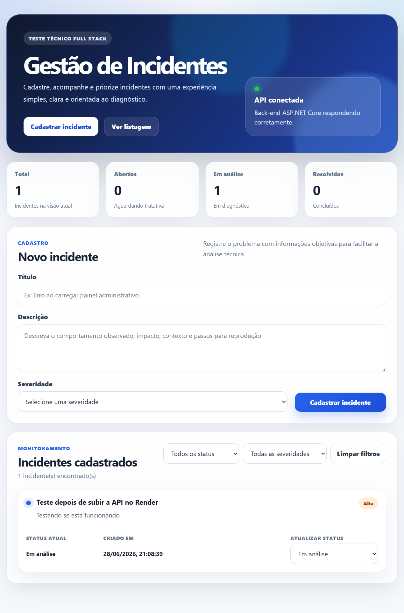

# Teste Técnico - Sistema de Gestão de Incidentes




Sistema full stack para gestão de incidentes, desenvolvido como parte de um teste técnico. O projeto contempla front-end, back-end, persistência em banco de dados, logs mínimos para diagnóstico, testes automatizados, documentação de API, nota técnica e deploy demonstrativo.

## Aplicação online

Front-end publicado no GitHub Pages:

```txt
https://gustavocampelo.github.io/teste-tecnico-incidentes/
```

API publicada no Render:

```txt
https://incident-manager-api-yidz.onrender.com
```

Health check da API:

```txt
https://incident-manager-api-yidz.onrender.com/api/health
```

Endpoint principal da API:

```txt
https://incident-manager-api-yidz.onrender.com/api/incidents
```

> Observação: a API está hospedada no plano gratuito do Render. No primeiro acesso, ela pode levar alguns segundos para responder caso esteja em modo de espera. Se o indicador da API aparecer como indisponível, aguarde alguns segundos e atualize a página.

## Visão geral

A aplicação permite cadastrar, listar, filtrar e atualizar o status de incidentes. O fluxo foi pensado para simular um cenário real de acompanhamento de erros recorrentes em um sistema, permitindo registrar informações básicas do problema, severidade, status e datas de criação e atualização.

O front-end possui uma interface responsiva, cards de resumo, formulário com validações, filtros por status e severidade, atualização de status e um indicador dinâmico de disponibilidade da API.

## Funcionalidades

* Cadastro de incidentes
* Listagem de incidentes
* Filtro por status
* Filtro por severidade
* Atualização de status
* Validações no front-end
* Validações no back-end
* Persistência em banco de dados SQLite
* Logs das principais operações da API
* Testes automatizados dos cenários principais
* Indicador visual de disponibilidade da API
* Dados iniciais para demonstração
* Deploy demonstrativo online

## Tecnologias utilizadas

### Back-end

* ASP.NET Core Web API
* Entity Framework Core
* SQLite
* xUnit
* Logs nativos com `ILogger`
* Docker

### Front-end

* React
* TypeScript
* Vite
* Axios
* CSS

### Deploy

* GitHub Pages para publicação do front-end
* GitHub Actions para build e deploy do front-end
* Render para hospedagem da API
* Docker para empacotamento e execução da API

## Estrutura do projeto

```txt
teste-tecnico-incidentes/
│
├── .github/
│   └── workflows/
│       └── deploy-frontend.yml
│
├── backend/
│   ├── IncidentManager.Api/
│   └── IncidentManager.Tests/
│
├── frontend/
│   └── incident-manager-web/
│
├── docs/
│   ├── images/
│   │   └── preview.png
│   └── nota-tecnica.md
│
├── Dockerfile
├── README.md
└── .gitignore
```

## Como validar rapidamente

1. Acesse a aplicação publicada no GitHub Pages.
2. Aguarde o indicador da API ficar verde.
3. Cadastre um novo incidente preenchendo título, descrição e severidade.
4. Verifique se o incidente aparece na listagem.
5. Altere o status do incidente para "Em análise" ou "Resolvido".
6. Utilize os filtros por status e severidade.
7. Acesse `/api/health` para validar a disponibilidade da API.
8. Execute `dotnet test` localmente para validar os testes automatizados.

## Como executar localmente

### Pré-requisitos

É necessário ter instalado:

* .NET SDK 9
* Node.js
* npm
* Git

## Executando o back-end

Acesse a pasta da API:

```bash
cd backend/IncidentManager.Api
```

Restaure as dependências:

```bash
dotnet restore
```

Execute a API:

```bash
dotnet run
```

A API será executada localmente em:

```txt
http://localhost:5252
```

Endpoint de saúde:

```txt
http://localhost:5252/api/health
```

Endpoint de incidentes:

```txt
http://localhost:5252/api/incidents
```

## Executando o front-end

Em outro terminal, acesse a pasta do front-end:

```bash
cd frontend/incident-manager-web
```

Instale as dependências:

```bash
npm install
```

Execute o projeto:

```bash
npm run dev
```

O front-end será executado em:

```txt
http://localhost:5173
```

Por padrão, em ambiente local, o front-end consome a API em:

```txt
http://localhost:5252/api
```

Essa configuração está no arquivo:

```txt
frontend/incident-manager-web/src/services/api.ts
```

## Executando os testes

Acesse a pasta do back-end:

```bash
cd backend
```

Execute:

```bash
dotnet test
```

Os testes cobrem os principais cenários da API, incluindo:

* Criação de incidente válido
* Validação de incidente sem título
* Listagem de incidentes cadastrados
* Retorno de erro ao buscar incidente inexistente
* Atualização de status de um incidente

## Build do front-end

Para validar o build do front-end:

```bash
cd frontend/incident-manager-web
npm run build
```

## Endpoints da API

### Health check

```http
GET /api/health
```

Retorna o status de disponibilidade da API.

Exemplo de resposta:

```json
{
  "status": "Healthy",
  "timestamp": "2026-06-28T19:03:10.0336398Z"
}
```

### Listar incidentes

```http
GET /api/incidents
```

Parâmetros opcionais:

```txt
status
severity
```

Exemplo:

```http
GET /api/incidents?status=Aberto&severity=Alta
```

### Buscar incidente por ID

```http
GET /api/incidents/{id}
```

### Criar incidente

```http
POST /api/incidents
```

Exemplo de requisição:

```json
{
  "title": "Erro ao carregar painel administrativo",
  "description": "Usuário relata que o painel fica carregando indefinidamente ao informar o CNPJ.",
  "severity": "Alta"
}
```

### Atualizar incidente

```http
PUT /api/incidents/{id}
```

Exemplo de requisição:

```json
{
  "title": "Erro ao carregar painel administrativo",
  "description": "Usuário relata que o painel fica carregando indefinidamente ao informar o CNPJ.",
  "severity": "Alta",
  "status": "EmAnalise"
}
```

### Atualizar status do incidente

```http
PATCH /api/incidents/{id}/status
```

Exemplo de requisição:

```json
{
  "status": "Resolvido"
}
```

### Remover incidente

```http
DELETE /api/incidents/{id}
```

## Valores aceitos

### Severidade

```txt
Baixa
Media
Alta
Critica
```

### Status

```txt
Aberto
EmAnalise
Resolvido
```

## Logs

A API registra logs mínimos nas principais operações:

* Listagem de incidentes
* Criação de incidente
* Atualização de incidente
* Alteração de status
* Tentativas de buscar, atualizar ou remover incidentes inexistentes

Esses logs auxiliam no diagnóstico de problemas e na rastreabilidade das operações.

## Deploy

### Front-end

O front-end é publicado no GitHub Pages por meio de GitHub Actions.

Arquivo do workflow:

```txt
.github/workflows/deploy-frontend.yml
```

Durante o build, a variável `VITE_API_BASE_URL` é utilizada para configurar a URL pública da API.

### Back-end

A API é publicada no Render utilizando Docker.

Arquivo Docker:

```txt
Dockerfile
```

A API escuta a porta definida pelo ambiente de hospedagem e expõe os endpoints necessários para o front-end.

## Observações sobre persistência

O banco utilizado é SQLite para simplificar a execução local e o entendimento do projeto.

No ambiente gratuito do Render, a persistência com SQLite deve ser considerada demonstrativa. Em um ambiente produtivo, o ideal seria utilizar um banco gerenciado, como PostgreSQL ou SQL Server.

## Nota técnica

A análise técnica do incidente, decisões, trade-offs e melhorias futuras estão documentadas em:

```txt
docs/nota-tecnica.md
```

## Decisões e boas práticas demonstradas

* Separação entre front-end e back-end
* API REST documentada
* Uso de DTOs para entrada de dados
* Validações no front-end e no back-end
* Logs para diagnóstico
* Testes automatizados
* Configuração de CORS para integração entre front-end e API
* Uso de variável de ambiente para URL da API no deploy
* Dockerização da API
* Deploy automatizado do front-end com GitHub Actions
* Documentação com instruções claras de execução
